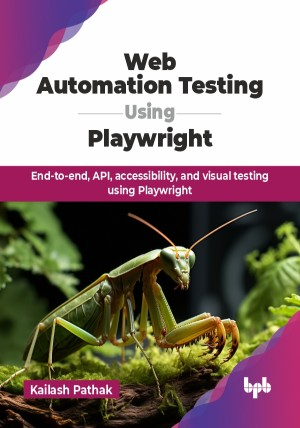

# Web Automation Testing Using Playwright

End-to-end, API, accessibility, and visual testing using Playwright.

This is the repository for [Web Automation Testing Using Playwright
](https://bpbonline.com/products/web-automation-testing-using-playwright?variant=44288671744200),published by BPB Publications.

## About the Book
The purpose of the book Web Automation Testing Using Playwright is to teach you how to use Playwright to automate your web testing. Playwright, a powerful automation tool developed by Microsoft, is a modern web automation framework that is fast, reliable, and easy to use.

This book begins by introducing automation testing, its benefits, and Playwright, covering setup, scripting, and Playwright's architecture. It guides you through creating frameworks, selector strategies, and handling complex web elements like shadow DOM and iframes. Explore Playwright features such as Codegen, Inspector, UI mode, debugging with Trace Viewer, and generating detailed reports. Learn advanced techniques like building frameworks using Page Object Model (POM), integrating Cucumber/BDD, API testing, HTTP request interception, and accessibility and visual testing. Additionally, the book explores test execution in CI/CD tools, parallel testing, AI-driven test automation, leveraging generative AI like ChatGPT, and future trends in test automation.

By the end of this book, you will be a web automation expert, writing efficient tests that validate web app functionality. Automate complex scenarios, handle edge cases, and leverage AI for intelligent testing. 

## What You Will Learn
• Writing testing scripts for end-to-end, functional, API, accessibility, and visual tests with Playwright.

• Mastering UI elements like alerts, tabs, drag-and-drop, iframes, and shadow DOM handling.

• Debugging effectively using Playwright features like Codegen, Inspector, UI mode, and Trace Viewer.

• Implementing Cucumber/BDD, Page Object Model (POM), and CI/CD pipeline integration with Playwright.

• Leveraging AI tools for test automation, including script creation, debugging, and understanding generative AI like ChatGPT.
